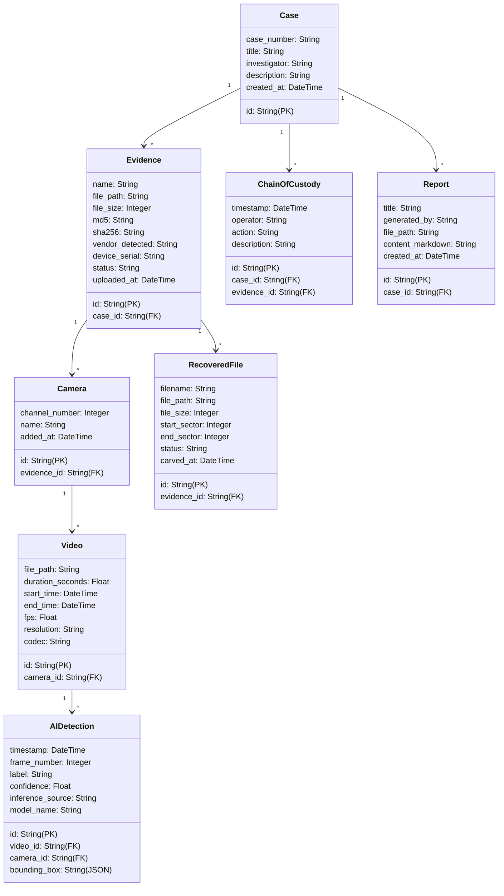

# Final Integration Specification (Backend + AI)

This document provides a definitive technical integration specification for the React Frontend Developer and Forensic Engineering teammates. All specifications are derived from the actual, active implementation of the FastAPI backend and AI pipelines.

---

## 1. Executive Summary
This document delineates the API contracts, media serving pathways, database relationships, and low-level boundary hooks for the DVR/NVR Forensic Analysis Tool. The backend acts as a central ingestion router, digital custody ledger, and AI analytics pipeline manager. LOW-LEVEL parsing and FRONTEND UI representation are delegated to respective team members using these static interface contracts.

---

## 2. System Architecture Overview
The backend architecture is structured as follows:
- **FastAPI HTTP REST Layer**: Receives uploads, lists cases, triggers CV analyses, normalizes event tracking, and compiles markdown reports.
- **SQLAlchemy ORM Data Interface**: Models cases, evidence metadata blocks, physical/logical cameras, video clips, recovered file fragments, ledger entries, and completed report files.
- **OpenCV & YOLOv8 Processing Core**: Operates synchronous video decoding (resolution, FPS, codec, duration extraction) and CPU-bound YOLO object parsing (persons, vehicles).

---

## 3. Backend Technology Stack
- **Web Engine**: FastAPI `0.100.0` / Starlette
- **Server Runner**: Uvicorn standard
- **Database Engine**: SQLAlchemy `2.0` with standard SQLite driver (`forensic.db`)
- **Computer Vision & AI**: OpenCV-Python-headless `4.7.0`, Ultralytics YOLOv8 `8.4.127`, PyTorch CPU `2.13.0`
- **Testing Core**: pytest `9.1.1`

---

## 4. REST API Contracts

### Case Management Endpoints

#### POST `/api/v1/cases/`
- **Purpose**: Register a new forensic case.
- **Request Body** (`schemas.CaseCreate`):
  ```json
  {
    "case_number": "CASE-101",
    "title": "Main Lobby Theft",
    "investigator": "Detective Miller",
    "description": "Footage audit for lobby cameras."
  }
  ```
- **Successful Status**: `201 Created`
- **Response Structure** (`schemas.CaseResponse`):
  ```json
  {
    "id": "e2f082d2-72a2-b281-0081-8b9cad0e1f20",
    "case_number": "CASE-101",
    "title": "Main Lobby Theft",
    "investigator": "Detective Miller",
    "description": "Footage audit for lobby cameras.",
    "created_at": "2026-08-24T15:07:29.964143"
  }
  ```
- **Errors**: `400 Bad Request` (Case number UNIQUE constraint fails).

#### GET `/api/v1/cases/`
- **Purpose**: Retrieve all registered forensic cases.
- **Successful Status**: `200 OK`
- **Response Structure**: `List[schemas.CaseResponse]`

#### GET `/api/v1/cases/{case_id}`
- **Purpose**: Retrieve detailed records of a specific case.
- **Successful Status**: `200 OK`
- **Response Structure**: `schemas.CaseResponse`
- **Errors**: `404 Not Found` (Case ID doesn't exist).

---

### Ingest & Evidence Endpoints

#### GET `/api/v1/evidence/?case_id={case_id}`
- **Purpose**: List all ingested evidence files linked to a case.
- **Query Parameter**: `case_id` (str, required)
- **Successful Status**: `200 OK`
- **Response Structure**: `List[schemas.EvidenceResponse]`

---

## 5. Evidence Upload Contract

#### POST `/api/v1/evidence/upload`
- **Purpose**: Upload evidence, compute digital hashes, scan vendor signatures, extract camera timelines, and carve unallocated sector fragments.
- **Content-Type**: `multipart/form-data`
- **Required Fields**:
  - `case_id` (Form standard UTF-8 string)
  - `file` (Multipart file stream)
- **Accepted File Types**: Any file binary stream (supports standalone video formats e.g. `.mp4`, `.avi`, `.mkv` as well as raw file systems/images).
- **Enforced Max Size**: None (no filesize check is hardcoded in the endpoint).
- **File Storage Location**: `storage/uploads/`
- **Calculations**: MD5 and SHA-256 signatures are calculated concurrently using a chunkwise file reader (`hashlib`).
- **Vendor & Serial Signature Parsing**: Performed via byte signature analysis on the initial sectors (Hikvision signature `"HKVS"`, Dahua signature `"DHFS"`, CP Plus signature `"DHFS\x00"`, Uniview/CP Plus fallback check).
- **Successful Status**: `202 Accepted`
- **Response Structure** (`schemas.EvidenceResponse`):
  ```json
  {
    "id": "679b9e27-7de8-4afa-9ab3-a89f4630c215",
    "case_id": "b854a5e0-605d-415c-b85d-484c7ef463ce",
    "name": "demo.mp4",
    "file_path": "storage/uploads\\2cab5b59_demo.mp4",
    "file_size": 2905644,
    "md5": "2cab5b59a1cf3b97b76bbedc28787327",
    "sha256": "3e1098d80aa56eef79a9350963be4b0dc557e685770a311514e20a83e1745df5",
    "vendor_detected": "Hikvision",
    "device_serial": "HIK-99238-X8",
    "status": "Ingested",
    "uploaded_at": "2026-08-24T22:42:32.124503"
  }
  ```
- **Database Side-Effects**: Creates `Evidence`, `Camera`, `Video` objects and logs `ChainOfCustody` records in a single atomic transaction. Saves recovered file fragments inside `RecoveredFile`.
- **Errors**:
  - `404 Not Found`: Case ID not registered.
  - `500 Internal Server Error`: Stream write failures or cryptographic hashing execution exceptions.

---

## 6. Forensic Engine Integration Contract

The forensic boundaries reside in `app/services/forensic_service.py`. The interface hooks are synchronous and wait for low-level module imports:

### Hook 1: Signature Scan
```python
@staticmethod
def identify_vendor_from_bytes(file_path: str) -> tuple[str, str]:
    """
    Inputs:
        file_path (str): Absolute file path to the evidence file.
    Returns:
        tuple[str, str]: (vendor_name, device_serial)
    """
```
- **Current Behavior**: `PARTIALLY IMPLEMENTED`. Reads initial 2048 bytes of the binary header. Searches for `"HKVS"` (Hikvision, serial `"HIK-99238-X8"`), `"DHFS"` (Dahua, serial `"DH-88127-C3"`), `"DHFS\x00"` (CP Plus, serial `"CP-77182-Y2"`), or handles filenames with Uniview strings (serial `"UNV-SIM-V5"`). Falls back to `"Generic"` with serial `"GEN-DCA62-99"`.

### Hook 2: Video Metadata & Channel Parser
```python
@staticmethod
def extract_cameras_and_videos(evidence_id: str, file_path: str, vendor: str) -> list[dict[str, Any]]:
    """
    Inputs:
        evidence_id (str): Database UUID of the evidence.
        file_path (str): File location.
        vendor (str): Detected vendor name.
    Returns:
        list[dict[str, Any]]: List of channel cameras and video objects.
    """
```
- **Current Behavior**: `PARTIALLY IMPLEMENTED`. If the file extension is a standard video (`.mp4`, `.avi`, `.mkv`), it parses real duration, FPS, resolution, and fourcc codec details via OpenCV (`cv2.VideoCapture`). Otherwise, it returns 2-3 camera channels with simulated start/end timestamps and segments based on the vendor type (e.g. Channel 1 Main Gate, Channel 2 Reception, Channel 3 Warehouse).

### Hook 3: Deleted Fragments Carver
```python
@staticmethod
def carve_deleted_videos(evidence_id: str, file_path: str) -> list[dict[str, Any]]:
    """
    Inputs:
        evidence_id (str): Evidence registry UUID.
        file_path (str): Absolute path to the evidence storage location.
    Returns:
        list[dict[str, Any]]: List of dictionary metadata representing sector locations.
    """
```
- **Current Behavior**: `SIMULATED`. Synthetically returns two segments: Sector 2048–18432 (approx 8MB, `.mp4`), and Sector 450560–901120 (approx 230MB, `.dav`). Used as placeholder bounds for proprietary disk carvings.

---

## 7. Video API Contract

#### GET `/api/v1/evidence/{evidence_id}/videos`
- **Purpose**: Get all video clips extracted from an evidence case.
- **Successful Status**: `200 OK`
- **Response Structure**: `List[schemas.VideoResponse]`
  ```json
  [
    {
      "id": "24511ae5-bf23-4b5c-aaf1-3e5176e9bf81",
      "camera_id": "c40a588a-9c33-49ac-933c-8330c104d4fa",
      "file_path": "storage/uploads/2cab5b59_demo.mp4",
      "duration_seconds": 5.073,
      "start_time": "2026-08-24T15:07:29.964143",
      "end_time": "2026-08-24T15:17:29.964143",
      "fps": 14.9812734082397,
      "resolution": "1280x720",
      "codec": "H264"
    }
  ]
  ```

#### GET `/api/v1/videos/{video_id}/metadata`
- **Purpose**: Retrieve precise video properties extracted via OpenCV.
- **Successful Status**: `200 OK`
- **Response Structure**:
  ```json
  {
    "codec": "H264",
    "resolution": "1280x720",
    "fps": 14.9812734082397,
    "duration_seconds": 5.073,
    "start_time": "2026-08-24T15:07:29.964143T00:00",
    "end_time": "2026-08-24T15:17:29.964143T00:00"
  }
  ```

---

## 8. AI Processing Contract

#### POST `/api/v1/analysis/{video_id}`
- **Purpose**: Process a video segment using object detection convolutional networks (YOLOv8) or simulation fallback modes, registering coordinate timelines.
- **Request Body** (`schemas.AIAnalysisTrigger`):
  ```json
  {
    "classes": ["person", "car"],
    "mode": "REAL"
  }
  ```
  - Mode enum values: `"REAL"` or `"SIMULATED"`.
- **Successful Status**: `202 Accepted`
- **Execution Mechanism**: `SYNCHRONOUS`. The API handles frames parsing within the HTTP thread loop and blocks the calling client. No task queues or background polling are implemented.
- **Response Structure**:
  ```json
  {
    "status": "Completed",
    "mode": "REAL",
    "model_name": "YOLOv8n",
    "detections_count": 6,
    "processing_time": 1.7889,
    "error": null
  }
  ```
- **Errors**:
  - `404 Not Found`: Video, evidence, camera record references missing.
  - `500 Internal Server Error`: `YOLOv8` library not loadable or inference run error.

---

## 9. AI Detection Response

#### GET `/api/v1/analysis/{video_id}`
- **Purpose**: Get all verified AI detection entities found in a video.
- **Successful Status**: `200 OK`
- **Response Structure** (`List[schemas.AIDetectionResponse]`):
  ```json
  [
    {
      "id": "a1b2c3d4-e5f6-7a8b-9c0d-1e2f3a4b5c6d",
      "video_id": "24511ae5-bf23-4b5c-aaf1-3e5176e9bf81",
      "camera_id": "c40a588a-9c33-49ac-933c-8330c104d4fa",
      "timestamp": "2026-08-24T15:07:30.898643",
      "frame_number": 14,
      "label": "person",
      "confidence": 0.82,
      "bounding_box": {
        "x_min": 0.1,
        "y_min": 0.2,
        "x_max": 0.3,
        "y_max": 0.4
      },
      "inference_source": "REAL_MODEL",
      "model_name": "YOLOv8n"
    }
  ]
  ```
- **Inference Source values**: `"REAL_MODEL"` or `"SIMULATED"`.
- **Model Name values**: `"YOLOv8n"` or `"Simulated_Fallback"`.
- **Bounding Box Coordinate Convention**: `NORMALIZED 0-1` scaling relative to width and height dimensions of the frame:
  $$\text{x\_min} = \frac{\text{pixel\_x\_min}}{\text{frame\_width}}$$
  $$\text{y\_min} = \frac{\text{pixel\_y\_min}}{\text{frame\_height}}$$

---

## 10. Timeline Contract

#### GET `/api/v1/timeline/{case_id}`
- **Purpose**: Build chronologically sorted events list for a case.
- **Query Parameters**:
  - `camera_id` (str, Optional)
  - `event_type` (str, Optional) - accepts `"INGESTION"`, `"AI_DETECTION"`, `"AUDIT"`, `"RECOVERY"`.
  - `start_dt` (datetime, Optional) - ISO 8601 string.
  - `end_dt` (datetime, Optional) - ISO 8601 string.
  - `label` (str, Optional) - filter AI labels.
- **Successful Status**: `200 OK`
- **Response Structure** (`List[schemas.TimelineEventResponse]`):
  ```json
  [
    {
      "timestamp": "2026-08-24T15:07:29.964143",
      "event_type": "INGESTION",
      "source": "demo.mp4",
      "description": "Evidence file ingested and registered.",
      "context_id": "679b9e27-7de8-4afa-9ab3-a89f4630c215"
    },
    {
      "timestamp": "2026-08-24T15:07:30.898643",
      "event_type": "AI_DETECTION",
      "source": "CAM-01 Ingest",
      "description": "AI object match: 'person' detected (confidence 82%).",
      "context_id": "24511ae5-bf23-4b5c-aaf1-3e5176e9bf81"
    }
  ]
  ```

---

## 11. Chain-of-Custody Contract

#### GET `/api/v1/chain-of-custody/{evidence_id}`
- **Purpose**: Retrieve the digital audit ledger trails for a piece of evidence.
- **Successful Status**: `200 OK`
- **Response Structure** (`List[schemas.ChainOfCustodyResponse]`):
  ```json
  [
    {
      "id": "bc12a52f-12c3-4d32-bcda-a32812bcada2",
      "case_id": "b854a5e0-605d-415c-b85d-484c7ef463ce",
      "evidence_id": "679b9e27-7de8-4afa-9ab3-a89f4630c215",
      "timestamp": "2026-08-24T22:42:32.124503",
      "operator": "Chief Auditor Jones",
      "action": "EVIDENCE_UPLOAD",
      "description": "Evidence file 'demo.mp4' uploaded. Hashing details: MD5=2cab5b59a1cf3b97b76bbedc28787327, SHA256=3e1098d80aa56eef79a9350963be4b0dc557e685770a311514e20a83e1745df5. Vendor identified: Hikvision."
    }
  ]
  ```
- **Automated Ledger Logs Triggers**:
  - `EVIDENCE_UPLOAD`: Ingest validation completion.
  - `EXTRACT_CHANNEL`: Cameras/Videos segment registration.
  - `AI_ANALYSIS_START`: CV analysis execution init.
  - `AI_ANALYSIS_COMPLETE`: Successful CV classification database commit.
  - `AI_ANALYSIS_FAILED`: Real/Simulated routing exception.

---

## 12. Report Contract

#### POST `/api/v1/reports/{case_id}`
- **Purpose**: Compile a comprehensive Markdown audit report on disk file and save record details.
- **Request Body**:
  ```json
  {
    "title": "Police Audit Case Report",
    "generated_by": "Officer Davis"
  }
  ```
- **Successful Status**: `201 Created`
- **Format**: `Markdown (.md)`
- **Storage Location**: `storage/reports/`
- **Response Structure** (`schemas.ReportResponse`):
  ```json
  {
    "id": "cb1a52fc-56ea-4328-98bc-23589b21a3bc",
    "case_id": "b05d1a58-6da8-4c12-32b4-e22894bfa23b",
    "title": "Police Audit Case Report",
    "generated_by": "Officer Davis",
    "file_path": "storage/reports\\e22894bf_report.md",
    "content_markdown": "# Police Department Forensic Audit Report...",
    "created_at": "2026-08-24T22:42:32.553920"
  }
  ```

#### GET `/api/v1/reports/download/{case_id}`
- **Purpose**: Direct download handler for the compiled report file.
- **Successful Status**: `200 OK`
- **Content-Type**: `text/markdown` / `application/octet-stream`

---

## 13. Database Handoff



---

## 14. Datetime Standard
- **Database standard representation**: Timezone-naive date/time stamps saved in SQLite.
- **API Serializations format**: Timezone-aware UTC timestamps serialized as ISO 8601 strings: `YYYY-MM-DDTHH:MM:SS.ffffff+00:00` or `YYYY-MM-DDTHH:MM:SS.ffffffZ`.
- **Frontend notice**: Interpret incoming datetime strings directly as ISO 8601 UTC times. URL-encode parameters (e.g. `%2B00:00` or `Z`) to prevent space conversion in query filters!

---

## 15. Error Handling
The standard API error model uses FastAPI's `HTTPException` returning JSON:
```json
{
  "detail": "Case registry ID not found."
}
```
### Verification Error Status Codes:
- `400 Bad Request`: Validation parser fields fail or database constraints fail (e.g. duplicate case numbers).
- `404 Not Found`: Query entity UUID (case, evidence, video, cameras) does not exist in SQLite tables.
- `422 Unprocessable Entity`: Invalid request parameter values (e.g. badly formatted datetime query string).
- `500 Internal Server Error`: Low-level writing exceptions, OpenCV frame parsing crash, or YOLO failures.

---

## 16. Static File Serving
- **Mounted Path**: `/static`
- **Physical Directory**: `storage/`
- **Structure mapping**:
  - Uploaded packages: `/static/uploads/{file_name}`
  - Extracted clips: `/static/extracted/{file_name}`
  - Reports: `/static/reports/{file_name}`
- **Permissions**: Publicly browser-accessible. No authentication middlewares are mounted.
- **Video Playback**: Fully supports Standard HTTP Range parsing out of the box (provided by Starlette's `StaticFiles` response streams) allowing users to scrub and adjust video track playheads.

---

## 17. CORS / Frontend Connection
- **Allowed Origins**: `["*"]` (Allowed to query endpoints from any origin, including `http://localhost:5173`).
- **Allowed Methods**: `["*"]`
- **Allowed Headers**: `["*"]`
- **Credentials**: `True` (Supports Cookies and authorization headers).

---

## 18. Authentication
- **Status**: `NOT IMPLEMENTED`
- Public access is permitted on all endpoints. JWT routers or Bearer scopes do not exist in the active codebase.

---

## 19. Current Implementation Status

| Feature | Status | Evidence in Code | Notes |
| --- | --- | --- | --- |
| FastAPI | COMPLETE | `app.main:app` | Routers, middleware, and prefix loaded. |
| SQLite/Database | COMPLETE | `app.database.session` | SQLAlchemy sessions and schema tables creation. |
| Case APIs | COMPLETE | `app.api.cases` | CRUD handlers for post/get cases. |
| Evidence Upload | COMPLETE | `app.api.evidence` | Upload, hash, vendor check, parser triggers. |
| MD5 Hashing | COMPLETE | `ForensicService.calculate_hashes` | Returns 32-char hex signatures. |
| SHA-256 Hashing | COMPLETE | `ForensicService.calculate_hashes` | Returns 64-char hex signatures. |
| Vendor Detection | PARTIALLY COMPLETE | `ForensicService.identify_vendor_from_bytes` | Signature matched for HKVS/DHFS; simulated serials. |
| Forensic Integration | PARTIALLY COMPLETE | `forensic_service.py` | Standalone MP4 extraction working; folder carving mock. |
| Video Extraction | COMPLETE | `ForensicService.extract_cameras_and_videos` | Single MP4 extracts duration/FPS/res; otherwise simulates. |
| Video APIs | COMPLETE | `app.api.videos` | Retrieve video attributes and metadata. |
| AI Detection | COMPLETE | `app.services.ai_service` | YOLOv8n CPU detections saved in tables. |
| Async AI | STATS: `NOT IMPLEMENTED` | `api.ai:trigger_video_analysis` | Handled to process synchronously. |
| Timeline | COMPLETE | `app.services.timeline_service` | Retraced boundaries, cameras, and type filters. |
| Chain of Custody | COMPLETE | `app.api.chain_of_custody` | Logs events and hashes. |
| Reports | COMPLETE | `app.api.reports` | Compiles Markdown reports. |
| Static Files | COMPLETE | `app.main` | Mounts static directory. |
| CORS | COMPLETE | `app.main:CORSMiddleware` | Configured to allow all origins `["*"]`. |
| JWT | NOT IMPLEMENTED | - | No auth dependencies exist. |
| Log Rotation | NOT IMPLEMENTED | - | Standalone print and stdout loggers. |

---

## 20. End-to-End Flow

```
Create Case (WORKING)
↓
Upload Evidence (WORKING)
↓
Calculate MD5/SHA-256 (WORKING)
↓
Detect Vendor (WORKING)
↓
Extract Cameras/Videos (WORKING - REAL for MP4/AVI uploads, SIMULATED for directory dumps)
↓
Display Videos (WORKING - Served via /static/)
↓
Run AI Segment (WORKING - Synchronous)
↓
Detect Person/Vehicle (WORKING - real YOLOv8n object predictions)
↓
Store Bounding Boxes (WORKING - normalized coordinate strings)
↓
Recover Deleted Fragments (WORKING - simulated segment sectors list)
↓
Unified Timeline (WORKING - event filters and camera filters)
↓
Chain of Custody (WORKING - registers upload, extract, start, and end logs)
↓
Generate Report (WORKING - saves report.md template on disk)
```

---

## 21. What the Frontend Developer Needs From Backend

- **Base URL**: `http://localhost:8000`
- **Prefix**: `/api/v1`

### 1. Ingestion Flow (Upload File)
Submit a `multipart/form-data` request:
```bash
curl -X POST "http://localhost:8000/api/v1/evidence/upload" \
  -F "case_id=b854a5e0-605d-415c-b85d-484c7ef463ce" \
  -F "file=@demo.mp4"
```
**Handling**: Expect a HTTP 202 code. Immediately redirect the user to a "Processing Case Timeline" panel.

### 2. Video Playback
Retrieve all videos for an evidence ID:
`GET http://localhost:8000/api/v1/evidence/{evidence_id}/videos`
Construct HTML5 video element source URL using:
$$\text{Playback URL} = \text{Base URL} + \text{video.file\_path}$$
*(Example: `http://localhost:8000/static/uploads/2cab5b59_demo.mp4`)*

### 3. Object Detection Overlays
Trigger AI Analysis:
```bash
curl -X POST "http://localhost:8000/api/v1/analysis/{video_id}" \
  -H "Content-Type: application/json" \
  -d '{"classes": ["person", "car"], "mode": "REAL"}'
```
Detections results are normalized coordinates (`x_min`, `y_min`, `x_max`, `y_max`). To draw CSS bounding box overlays on standard HTML5 players:
$$\text{CSS Left} = \text{box.x\_min} \times \text{player\_width}$$
$$\text{CSS Top} = \text{box.y\_min} \times \text{player\_height}$$
$$\text{CSS Width} = (\text{box.x\_max} - \text{box.x\_min}) \times \text{player\_width}$$
$$\text{CSS Height} = (\text{box.y\_max} - \text{box.y\_min}) \times \text{player\_height}$$

---

## 22. What the Forensic Engineer Needs From Backend

Low-level code hooks are located in [forensic_service.py](file:///C:/Users/somes/.gemini/antigravity/scratch/forensic_dvr_tool/backend/app/services/forensic_service.py). Code modifications should be restricted to these three function bodies:

### 1. File signature parser
```python
@staticmethod
def identify_vendor_from_bytes(file_path: str) -> tuple[str, str]:
```
- **Goal**: Replace the signature scanning string checks (HKVS, DHFS) with sector-by-sector sector-header parsing.
- **Side effects**: None on the database. Returning custom string pairs gets auto-populated inside `vendor_detected` and `device_serial` columns.

### 2. File Extractor
```python
@staticmethod
def extract_cameras_and_videos(evidence_id: str, file_path: str, vendor: str) -> list[dict[str, Any]]:
```
- **Goal**: Replace template channels (Lobby, Gate) with actual offset extractions. For directory structures, parse directories, write raw `.h264` tracks directly to `storage/extracted/`, and return names/paths of files.

### 3. File Carver
```python
@staticmethod
def carve_deleted_videos(evidence_id: str, file_path: str) -> list[dict[str, Any]]:
```
- **Goal**: Remove simulated coordinates. Implement raw unallocated data scanning using magic indicators and return lists of sector ranges.

---

## 23. Final Integration Checklist
- [x] Create case: `WORKING`
- [x] Upload evidence: `WORKING`
- [x] Calculate hashes: `WORKING`
- [x] Detect vendor: `WORKING`
- [x] Extract videos: `WORKING`
- [x] Retrieve videos: `WORKING`
- [x] Play extracted video: `WORKING`  
- [x] Start AI analysis: `WORKING` (synchronous)
- [x] Check AI status: `WORKING` (polled via GET /analysis/{video_id})
- [x] Retrieve detections: `WORKING`
- [x] Display bounding boxes: `WORKING`
- [x] Retrieve timeline: `WORKING`
- [x] Retrieve chain of custody: `WORKING`
- [x] Recover deleted videos: `WORKING` (returns carved simulated listings)
- [x] Generate report: `WORKING`
- [x] Access report: `WORKING`
- [x] React frontend can connect through CORS: `WORKING` (unrestricted origin * allowed)

---

## 24. Known Gaps / Risks
- **Synchronous AI Processing**: Currently, triggering YOLOv8n object detection block-locks the FastAPI HTTP thread. If a user uploads large recordings, the frontend request will timeout or freeze the backend server.
- **Lack of Authentication**: Clear forensic lines of custody are logged based on investigator parameters, but no security (JWT/Token-auth) is active, exposing endpoint configurations.
- **CPU Inference limit**: YOLOv8n inferences operate entirely on CPU. Running concurrent validations will increase response latencies.
- **Forensic parsing simulation**: Raw filesystem metadata extraction is stubbed and lacks low-level partition carving algorithms.
