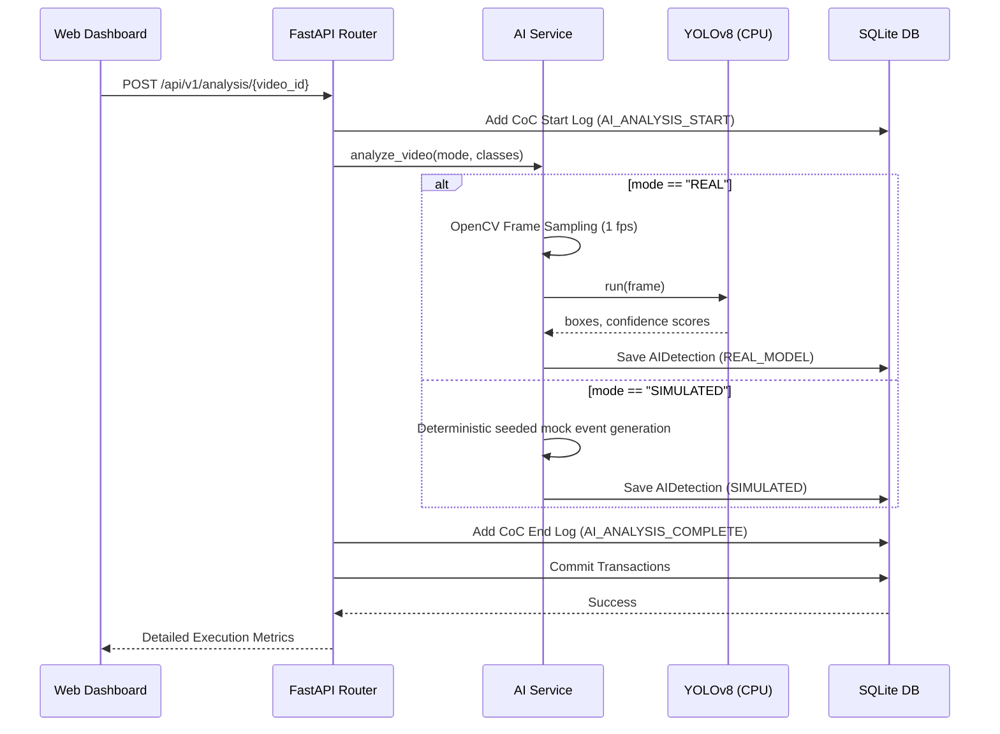

# App Architecture & Data Flows

This document details the system design, components, and data pipelines of the Multi-Vendor DVR/NVR Forensic Analysis Tool.

## System Architecture Overview

The system operates as a classic tiered model consisting of a Web UI client, a FastAPI API gateway, business logic services, database mapping layers, static storage directories, and analysis engines (Computer Vision and File Carving).

```mermaid
graph TB
    subgraph Frontend Client (React)
      UI[UI Dashboard & Media Player]
    end

    subgraph REST Web Layer (FastAPI)
      API[FastAPI Router Gateways]
    end

    subgraph Service Coordination Layer
      AI_S[AI Service]
      FOR_S[Forensic Service]
      TIM_S[Timeline Service]
    end

    subgraph Persistence & File Assets
      DB[(SQLite Database)]
      STORE[Physical Storage Directories]
    end

    subgraph Processing Engines
      YOLO[YOLOv8n CPU Inference Engine]
      CV2[OpenCV Frame Sampler]
      CARV[Sector Carving Logic]
    end

    %% Wiring connections
    UI <-->|HTTP REST Requests| API
    API <-->|SQLAlchemy Models| DB
    API <-->|Pydantic Schemas| AI_S
    API <-->|Coordination| FOR_S
    API <-->|Unified Logic| TIM_S

    AI_S <-->|CV/ML Operations| CV2
    CV2 -->|Frames| YOLO
    YOLO -->|Detections| DB
    
    FOR_S -->|Signatures / Mappings| CARV
    FOR_S -.->|Future Raw Block Parsing| STORE
    
    API -.->|Serve Video / PDF Files| STORE
```

---

## Data Pipeline Flows

### 1. Ingestion & Extraction Flow
This pipeline runs when a physical image dump or video file is ingested.

1. **Upload Request**: The React UI uploads a file using a `multipart/form-data` payload containing `case_id` and the raw data to `/api/v1/evidence/upload`.
2. **File Persistence**: The FastAPI router saves the upload chunkwise to `storage/uploads/`.
3. **Crypto Hash & Vendor Detection**:
   - Computes MD5 and SHA-256 signatures for the saved file.
   - Triggers vendor heuristics: Scans the first 16 bytes for signatures (`HKVS`/`WFS` (Hikvision), `DHFS` (Dahua), `CPPL` (CP Plus)) or runs case-insensitive file name parsing.
4. **Entity Registration**: Inserts an `Evidence` row into the database.
5. **Channel Layout Mapping**:
   - **Real Media Fallback**: If the upload is a playable video format (`.mp4`, `.avi`, `.mkv`), OpenCV reads it, extracts duration, resolution, fps, and registers it as Camera Channel 1.
   - **Simulated Blocks**: For NVR partition backups, the tool creates simulated camera paths and start/end times based on the identified vendor.
6. **Sector Carving**: Evaluates unallocated space to carving deleted fragments. Stubs generate 2 recovered segments (stored in `recovered_files` table).
7. **Chain of Custody**: Registers logs for `EVIDENCE_UPLOAD` and `EXTRACT_CHANNEL` in the database.

---

### 2. AI Inference Pipeline Flow
Instructs the AI engine to search target channels.

1. **Analysis Trigger**: The Client POSTs to `/api/v1/analysis/{video_id}` specifying target classes (e.g. `["person", "vehicle"]`) and execution mode (`"REAL"` or `"SIMULATED"`).
2. **Audit Logging**: Inserts an `AI_ANALYSIS_START` log into the `chain_of_custody` ledger.
3. **Inference Execution**:
   - **REAL Mode**:
     - OpenCV loads the video file from its registered path.
     - Frame sampling rate settings are applied (samples 1 frame per second).
     - Feeds frames to YOLOv8n (Pytorch CPU weights).
     - Identifies bounding boxes, translates coordinates to relative page floats `[0.0, 1.0]`, maps COCO classes to filter targets, and saves matches.
   - **SIMULATED Mode**:
     - Generates deterministic, visually coherent detections based on the target video UUID hash.
4. **Data Persistence**: Overwrite transactions save `ai_detections` directly linked to the video frame index.
5. **Completion Audit**: Logs `AI_ANALYSIS_COMPLETE` (or `AI_ANALYSIS_FAILED` on exceptions) and commits all details atomically.



---

### 3. Unified Timeline Correlation Flow
Integrates events from multiple sources into a chronological dashboard.

1. **Timeline Query**: Request sent to `/api/v1/timeline/{case_id}` (optionally filtered by camera, start/end dates, event type, or AI label).
2. **Database Querying**:
   - Fetch video record starts and ends (`INGESTION` event).
   - Fetch objects tagged by YOLO processing (`AI_DETECTION` event).
   - Fetch carved sector fragments coordinates (`RECOVERY` event).
   - Fetch investigator operational actions (`AUDIT` event).
3. **UTC Normalization**: Unifies timezone-aware datetimes.
4. **Sorting**: Sorts all items chronologically ascending.
5. **Output JSON**: Returns `TimelineEventResponse` structures to populate the UI.

---

### 4. Forensic Reporting Flow
Provides a report file export.

1. **Compile Dossier**: Client POSTs properties (title, generated_by) to `/api/v1/reports/{case_id}`.
2. **Aggregation**: Gathers case facts, md5/sha-256 evidence logs, recovered sector ranges tables, chronological timeline events, and security disclaimers.
3. **Signatures**: Calculates SHA-256 checksum tags of the title to certify admissibility.
4. **Export File**: Saves the document as a physical markdown file under `storage/reports/Report_<case_number>_<timestamp>.md`.
5. **Ledgering**: Registers a `REPORT_GEN` chain of custody audit block.
6. **Response**: Returns compiled report contents.
