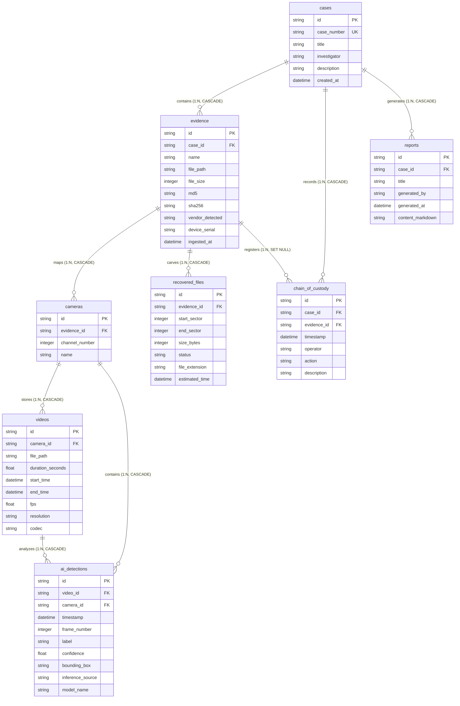

# Database Schema Design

The application utilizes a SQLite relational database backup (`forensic.db`). Database tables and models are defined programmatically using SQLAlchemy ORM declarations.

---

## Entity-Relationship Diagram

---

## Detailed Table Dictionary

### 1. `cases`
Stores registered legal investigation dossiers.
- **`id`** (`VARCHAR`, Primary Key): Relational UUID. Generates dynamically.
- **`case_number`** (`VARCHAR`, Unique, Indexed, Not Null): Investigator case tag (e.g., `CASE-2026-001`).
- **`title`** (`VARCHAR`, Not Null): Plain text moniker.
- **`investigator`** (`VARCHAR`, Not Null): Name of leading examiner handling the case.
- **`description`** (`TEXT`, Null): Case comments.
- **`created_at`** (`DATETIME`, Default: UTC Now): Log creation mark.
- **Relationships**:
  - `evidence` (Cascade: purge all orphans).
  - `chain_of_custody_logs` (Cascade: purge all orphans).
  - `reports` (Cascade: purge all orphans).

---

### 2. `evidence`
Stores properties of ingested storage disks or files.
- **`id`** (`VARCHAR`, Primary Key): UUID.
- **`case_id`** (`VARCHAR`, Foreign Key to `cases.id`, Not Null): Parent case association. Uses `ondelete="CASCADE"`.
- **`name`** (`VARCHAR`, Not Null): Plain name (e.g., `dvr_evidence_dump.img`).
- **`file_path`** (`VARCHAR`, Not Null): Path on server.
- **`file_size`** (`INTEGER`, Not Null): In bytes.
- **`md5`** (`VARCHAR`, Not Null): Cryptographic hash checking.
- **`sha256`** (`VARCHAR`, Not Null): Cryptographic integrity footprint checking.
- **`vendor_detected`** (`VARCHAR`, Not Null): Identified manufacture (Hikvision, Dahua, CP Plus, Generic).
- **`device_serial`** (`VARCHAR`, Null): Serial tag extracted from headers.
- **`ingested_at`** (`DATETIME`, Default: UTC Now).
- **Relationships**:
  - `cameras` (Cascade: purge all orphans).
  - `recovered_files` (Cascade: purge all orphans).
  - `chain_of_custody_logs` (Cascade: purge all orphans).

---

### 3. `cameras`
Maps visual recording channels.
- **`id`** (`VARCHAR`, Primary Key): UUID.
- **`evidence_id`** (`VARCHAR`, Foreign Key to `evidence.id`, Not Null): Source file association. Uses `ondelete="CASCADE"`.
- **`channel_number`** (`INTEGER`, Not Null): Stream channel index index (1, 2, 3, etc.).
- **`name`** (`VARCHAR`, Not Null): Friendly channel name (e.g. `CAM-01 Main Gate`).
- **Relationships**:
  - `videos` (Cascade: purge all orphans).

---

### 4. `videos`
Relational rows indicating extracted, playable video segments.
- **`id`** (`VARCHAR`, Primary Key): UUID.
- **`camera_id`** (`VARCHAR`, Foreign Key to `cameras.id`, Not Null): Source camera association. Uses `ondelete="CASCADE"`.
- **`file_path`** (`VARCHAR`, Not Null): Local server storage path for streaming.
- **`duration_seconds`** (`FLOAT`, Null): Segment playback length.
- **`start_time`** (`DATETIME`, Not Null): Standardized UTC metadata timeline start time.
- **`end_time`** (`DATETIME`, Not Null): Standardized UTC metadata timeline end time.
- **`fps`** (`FLOAT`, Null): Frames-per-second rate.
- **`resolution`** (`VARCHAR`, Null): Resolution metrics (e.g., `1280x720`).
- **`codec`** (`VARCHAR`, Null): Typology tags (e.g., `avc1` or `h264`).
- **Relationships**:
  - `ai_detections` (Cascade: purge all orphans).

---

### 5. `ai_detections`
Saves object recognition tags.
- **`id`** (`VARCHAR`, Primary Key): UUID.
- **`video_id`** (`VARCHAR`, Foreign Key to `videos.id`, Not Null): Target segment. Uses `ondelete="CASCADE"`.
- **`camera_id`** (`VARCHAR`, Foreign Key to `cameras.id`, Null): Link to source camera, patched into databases dynamically. Uses `ondelete="CASCADE"`.
- **`timestamp`** (`DATETIME`, Not Null): Frame relative timestamp.
- **`frame_number`** (`INTEGER`, Not Null): Video frame index coordinates.
- **`label`** (`VARCHAR`, Not Null): Coco object labels (`person`, `car`, `motorcycle`, `bus`, `truck`).
- **`confidence`** (`FLOAT`, Not Null): Classifier probability (0.0 to 1.0).
- **`bounding_box`** (`TEXT`, Not Null): Bounding dimensions stored as JSON string (contains normalized keys `x_min`, `y_min`, `x_max`, `y_max`).
- **`inference_source`** (`VARCHAR`, Default: `"REAL_MODEL"`, Null): Flag distinguishing `REAL_MODEL` (YOLO) from `SIMULATED` (fallback).
- **`model_name`** (`VARCHAR`, Default: `"YOLOv8n"`, Null): Name of weights file.

---

### 6. `recovered_files`
Records carved deleted sector blocks.
- **`id`** (`VARCHAR`, Primary Key): UUID.
- **`evidence_id`** (`VARCHAR`, Foreign Key to `evidence.id`, Not Null): Sub-image link. Uses `ondelete="CASCADE"`.
- **`start_sector`** (`INTEGER`, Not Null): Boundary starting physical address.
- **`end_sector`** (`INTEGER`, Not Null): Ending sector address.
- **`size_bytes`** (`INTEGER`, Not Null): Extracted byte count.
- **`status`** (`VARCHAR`, Not Null): Lifecycle status (`Scanning`, `Recovered`, `Corrupt`).
- **`file_extension`** (`VARCHAR`, Not Null): Codec container extension (`mp4`, `dav`).
- **`estimated_time`** (`DATETIME`, Null): Timestamps mapped to sector logs.

---

### 7. `chain_of_custody`
Immutable legal audit log tracking all actions.
- **`id`** (`VARCHAR`, Primary Key): UUID.
- **`case_id`** (`VARCHAR`, Foreign Key to `cases.id`, Not Null): Case dossier. Uses `ondelete="CASCADE"`.
- **`evidence_id`** (`VARCHAR`, Foreign Key to `evidence.id`, Null): Associated physical file, set to `ON DELETE SET NULL` to preserve logs if an evidence file is removed from disk.
- **`timestamp`** (`DATETIME`, Default: UTC Now).
- **`operator`** (`VARCHAR`, Not Null): Name of examiner checking.
- **`action`** (`VARCHAR`, Not Null): Audit code action (e.g. `CASE_CREATE`, `EVIDENCE_UPLOAD`, `EXTRACT_CHANNEL`, `AI_ANALYSIS_START`, `AI_ANALYSIS_COMPLETE`, `AI_ANALYSIS_FAILED`, `FILE_CARVE`, `REPORT_GEN`).
- **`description`** (`TEXT`, Not Null): Extended notes detailing hashes/parameters.

---

### 8. `reports`
Forensic reports compiled for exportation.
- **`id`** (`VARCHAR`, Primary Key): UUID.
- **`case_id`** (`VARCHAR`, Foreign Key to `cases.id`, Not Null): Cascade deleted. Uses `ondelete="CASCADE"`.
- **`title`** (`VARCHAR`, Not Null): Dossier title.
- **`generated_by`** (`VARCHAR`, Not Null): Author.
- **`generated_at`** (`DATETIME`, Default: UTC Now).
- **`content_markdown`** (`TEXT`, Not Null): Dossier report content.
