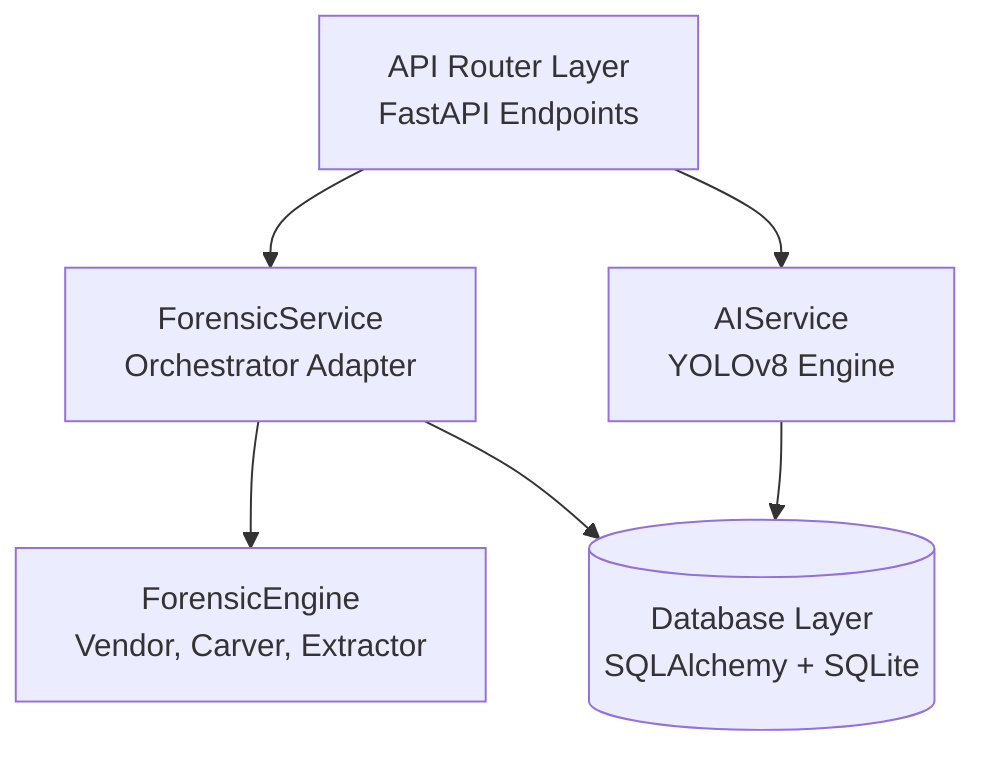

# FINAL ARCHITECTURE SPECIFICATION

This document outlines the core backend components, database structure, and the integration of the forensic engine.

## 1. Component Layering

## 2. Dynamic DB Updates and Schema Patches
SQLite databases are patched dynamically on uvicorn startup in `backend/app/main.py` to prevent structural conflicts during migration or test runs. Additions include:
- `camera_id` column inside `ai_detections` table (relational link).
- `inference_source` column inside `ai_detections` table (differentiation between `REAL_MODEL` / `SIMULATED`).
- `model_name` column inside `ai_detections` table (YOLOv8n / Custom).

## 3. Storage Configuration
All paths used by the forensic engine are tied to the backend settings (`FORENSIC_EXTRACTED_DIR`, `FORENSIC_RECOVERED_DIR`) dynamically loaded inside `backend/app/config.py`, ensuring consistent location alignment for file outputs.
