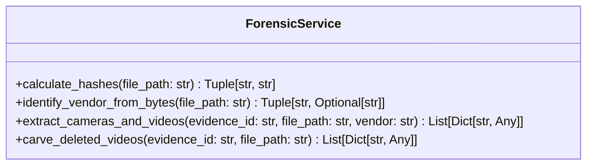

# Forensic Engineering Integration Guide

This guide is written for the **Forensic Engineering / proprietary filesystem parsing** teammate. It defines how low-level disc reconstruction modules must interface with the Backend team's FastAPI database structure.

Currently, the backend employs a **simulation harness** in [forensic_service.py](file:///C:/Users/somes/.gemini/antigravity/scratch/forensic_dvr_tool/backend/app/services/forensic_service.py) that mimics disk signature extraction, camera maps, and unallocated sector carving. The Forensic Engineer should replace these simulated stubs with real filesystem parsing libraries.

---

## 1. Interface and Entry Points

The interface is defined in `ForensicService` within `app/services/forensic_service.py`.



---

## 2. In-Depth Component Specifications

### A. Device & Vendor Identification
- **Function**: `identify_vendor_from_bytes(file_path: str)`
- **Current Behavior**: 
  - Scans the first 16 bytes of the physical image. If `HKVS`/`WFS` (Hikvision), `DHFS` (Dahua), or `CPPL`/`CPPLUS` (CP Plus) are detected, returns the vendor name and a mock serial number.
  - If no signature matches, falls back to parsing case-insensitive terms in the filename (e.g. `uniview`, `cpplus`, `dahua`, `hikvision`).
- **Expected Action**: The Forensic Engineer should extend the hex block scanning logic. It should read sector metadata blocks or master partitions to extract the device's actual manufacturer and hardware model.
- **Input**:
  - `file_path` (string): Absolute path to the physical disk image.
- **Output**:
  - A tuple: `(vendor_name: str, device_serial: Optional[str])`.
- **Integration Point**: Invoked during evidence upload in `/api/v1/evidence/upload`.

---

### B. Channel & Active Recording Extraction
- **Function**: `extract_cameras_and_videos(evidence_id: str, file_path: str, vendor: str)`
- **Current Behavior**:
  - **Real File Ingest (Fallback)**: If the uploaded file is a playable clip (`.mp4`, `.avi`, `.mkv`), OpenCV gathers parameters (duration, resolution, fps, codec) and registers it as Camera Channel 1.
  - **Simulated Ingest**: If a raw dump is uploaded, mocks camera maps (Hikvision: 3 channels, Dahua: 2 channels, CP Plus: 2 channels) and offsets recording ranges relative to the current server system time.
- **Expected Action**: 
  - The Forensic Engineer should implement proprietary filesystem disk indexing.
  - Parse the raw disk structure to:
    1. Identify active cameras and associate channel numbers.
    2. Extract recording blocks.
    3. Reconstruct contiguous recordings (resolving fragmented blocks).
    4. Save extracted clips to `storage/extracted/`.
    5. Return metadata detailing dates, resolution, frame rates, and codec formats.
- **Input**:
  - `evidence_id` (string UUID): Target database evidence record indicator.
  - `file_path` (string): Path to raw image disk file.
  - `vendor` (string): Vendor name used to select the parser.
- **Output**:
  - A list of dictionary objects structured as:
    ```python
    [
      {
        "channel_number": 1,
        "camera_name": "CAM-01 Loading Dock",
        "video": {
          "file_path": "C:\\path\\to\\extracted\\clip_cam1.mp4",
          "duration_seconds": 120.4,
          "start_time": datetime_utc,   # Timezone-aware datetime
          "end_time": datetime_utc,     # Timezone-aware datetime
          "fps": 25.0,
          "resolution": "1920x1080",
          "codec": "H264"
        }
      },
      ...
    ]
    ```
- **Database Effects**: Ingesting this data dynamically writes camera rows to `cameras` and segments records to `videos`.
- **Integration Point**: Executed automatically during evidence upload.

---

### C. Deleted Fragment Carving
- **Function**: `carve_deleted_videos(evidence_id: str, file_path: str)`
- **Current Behavior**: Mocks two fragments (MP4 and DAV formats) within unallocated disk sectors.
- **Expected Action**: Sweep the raw disk dump image for file headers/footers (e.g. `0x000001BA` for MPEG-PS, standard MP4 header signatures, H.264/H.265 NAL units) to identify and carve deleted recording fragments. Save carved files using unique paths in `storage/recovered/`.
- **Input**:
  - `evidence_id` (string UUID).
  - `file_path` (string).
- **Output**:
  - A list of parsed fragment metadata structured as:
    ```python
    [
      {
        "start_sector": 2048,
        "end_sector": 18432,
        "size_bytes": 8388608,
        "status": "Recovered",          # 'Scanning', 'Recovered', 'Corrupt'
        "file_extension": "mp4",
        "estimated_time": datetime_utc   # Estimated recording timestamp
      },
      ...
    ]
    ```
- **Database Effects**: Creates entries inside the `recovered_files` table, which are then included in the chronologized timeline view.
- **Integration Point**: Triggers automatically during evidence ingestion.

---

## 3. Implementation Requirements for the Forensic Parser

When writing proprietary parser modules, developers must follow these guidelines:
1. **Never Modify API Routers**: Relational CRUD models, REST routes, and schemas are already completed and verified. Keep parser integrations self-contained within `ForensicService`.
2. **Standardize on Timezone-Aware UTC**: The database unifies temporal tracks by enforcing UTC representation. Make sure datetime outputs use timezone-aware values:
   `datetime.now(timezone.utc)`
3. **Handle File Exports Safely**: File parser writes should target `storage/extracted/` or `storage/recovered/`. Maintain safe file path configurations to avoid folder path injection vulnerabilities.
4. **Resiliency**: Handle disk read errors gracefully. Low-level block reads should catch bad sector exceptions to prevent processing loop crashes.
