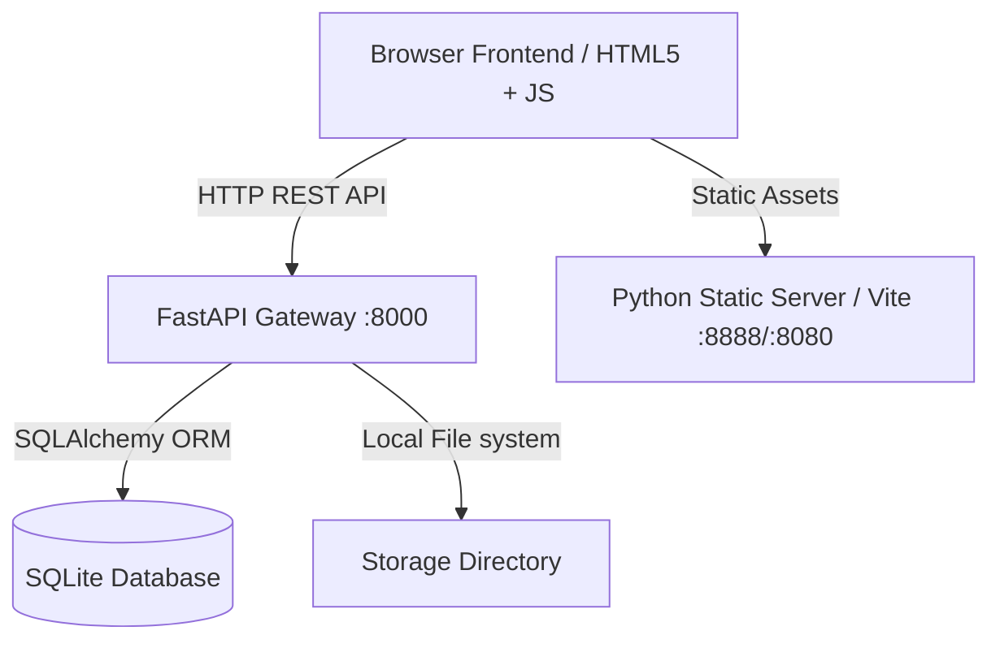

# SYSTEM INTEGRATION MANUAL

This document details how the React/HTML Frontend connects to the FastAPI Python backend and the SQLite forensic indexing ledger.

## 1. Network Topography



## 2. API Prefix Config
Frontend components query a centralized endpoint definition configured in `frontend/js/config.js`:
```javascript
const API_BASE_URL = "http://127.0.0.1:8000/api/v1";
const STATIC_BASE_URL = "http://127.0.0.1:8000";
```

## 3. Web Playback and Asset Streaming
FastAPI exposes the core storage path statically via `/static`. The frontend constructs direct URLs for evidence media:
- Extracted videos: `http://localhost:8000/static/extracted/{filename}`
- Recovered video fragments: `http://localhost:8000/static/recovered/{filename}`

## 4. Run Verification Suite
Run the automated verification suite to test the configuration and all pipelines end-to-end:
```bash
# Execute backend unit tests
cd backend
python -m pytest tests/test_api.py -v

# Run programmatic integration checks
python verify_integration.py
```
