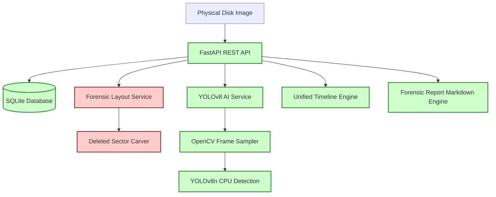

# Multi-Vendor DVR/NVR Forensic Analysis Tool - Project Overview

## Problem Statement
During criminal and corporate investigations, physical digital video recorders (DVRs) and network video recorders (NVRs) are often encountered as critical evidence sources. However, surveillance systems typically employ proprietary filesystems, custom container formats, and non-trivial recording mechanisms designed for security and physical device longevity. Standard operating systems cannot read these disk structures, resulting in filesystems appearing corrupted, empty, or unallocated.

Historically, investigators have struggled to:
1. Reconstruct logical video files from physical disk block images.
2. Handle vendor-specific storage partitions (e.g., Hikvision WFS, Dahua DHFS, CP Plus CPPL).
3. Identify and carve deleted recording fragments hidden in unallocated space.
4. Scale review sessions due to massive counts of recorded hours.
5. Guarantee legal admissibility by maintaining a tamper-proof chain of custody for digital evidence.

---

## Project Objective
The objective of this project is to develop a **Multi-Vendor DVR/NVR Forensic Analysis Tool** that allows forensic examiners to:
- Ingest raw disk images/dumps of DVR/NVR surveillance hard drives.
- Automatically identify the proprietary recording filesystem signature and vendor parameters.
- Recover and reconstruct logical camera channels and video segments.
- Carve deleted video fragments directly from raw blocks.
- Automate search pipelines using deep learning computer vision (YOLOv8) to filter objects of interest (persons/vehicles) without manual review.
- Chronologize all analytical logs into a unified, search-friendly forensic timeline.
- Generate legally admissible audit dossiers and chain of custody logs.

---

## Overall Solution
The custom application provides a web-based, full-stack pipeline:
1. **Evidence Ingestion**: Physical storage image dumps are uploaded to a FastAPI backend.
2. **Heuristic Parsing**: Analyzes system partition table metadata block headers (Hikvision, Dahua, CP Plus, Uniview) to recognize vendor characteristics.
3. **Forensic Recovery**: Maps active channels and runs sector-level carving algorithms to detect files.
4. **AI Video Inference**: Utilizes YOLOv8 (and a fallback simulation engine) to locate targets.
5. **Timeline & Custody Tracking**: Chronologizes all events into a temporal timeline.
6. **Dossier Generation**: Compiles reports including integrity hashes and cryptosignatures.

---

## Target DVR/NVR Vendors
The system targets four major manufacturers, matching signature lookups against device headers and fallback string heuristic parsers:
- **Hikvision**: Detects `HKVS` or `WFS` (Write File System) disk headers.
- **Dahua**: Detects `DHFS` (Dahua File System) disk headers.
- **CP Plus**: Detects `CPPL` or `CPPLUS` disk headers.
- **Uniview**: Detects `UNV-SIM` or filename-based parameters.

---

## Major Modules
- **FastAPI Core API Engine**: Exposes REST interfaces to manage cases, process uploads, retrieve timeline tracks, and trigger reports.
- **Forensic Pipeline Service**: Performs checksum hashing, searches block headers, and isolates sector frames.
- **AI Processing Pipeline**: Extracts video frames using OpenCV, runs YOLOv8n object detection, and stores normalized bounding boxes.
- **Timeline Correlation Engine**: Merges ingestion steps, AI detections, carved sector logs, and custody audit entries.
- **Report & Dossier Module**: Builds Markdown documents detailing findings and logs.

---

## Team Division
The engineering team is structured into three parallel workstreams:
1. **Backend + AI Team (Your Current Role)**: Built the FastAPI core application, schemas, models, services (AI, forensic layout, timeline), SQL database schema updates, test suites, and regression scripts.
2. **Frontend Team**: Responsible for UI dashboards, media player streaming, unified timeline search, and report exports.
3. **Forensic Engineering Team**: Responsible for low-level, proprietary filesystem parsing (replacing simulation stubs in `forensic_service.py` with actual C/C++/Python raw header parsing libraries).

---

## Current Backend Implementation Status
The backend acts as a highly functional, fully realized **prototype** with some simulated components:
- **FastAPI API Routing**: **REAL / IMPLEMENTED** (complete suite of endpoints for cases, evidence, videos, details, timeline, reports, chain-of_custody, analysis).
- **Database / Storage**: **REAL / IMPLEMENTED** (SQLite database schema loaded on startup and updated; physical folders created dynamically).
- **YOLOv8 AI Pipeline**: **REAL / IMPLEMENTED** (uses real OpenCV frame extraction, YOLOv8n CPU weights inference, with simulated fallback mode if YOLO library is missing).
- **Forensic Partition Layouts**: **SIMULATED** (analyzes real header magic bytes to detect vendors but simulates multi-channel extraction and sector carving fragments. Interface hooks are prepared for the Forensic Engineer).
- **Testing Suite**: **REAL / IMPLEMENTED** (Unit tests, simulated tests, real YOLO regression test using demo video, and metadata extraction tests).

---

## What the Final Product Target Looks Like
When fully realized, the tool will:
1. Parse multi-gigabyte hard drive forensic images without loading complete files into memory.
2. Support mounting Dahua/Hikvision physical structures as read-only virtual directories.
3. Run GPU-accelerated YOLO scans on high-definition video feeds.
4. Auto-detect time skew offsets since NVR internal clocks are frequently set incorrectly.
5. Provide a React-based interface with video bounding box overlays.
