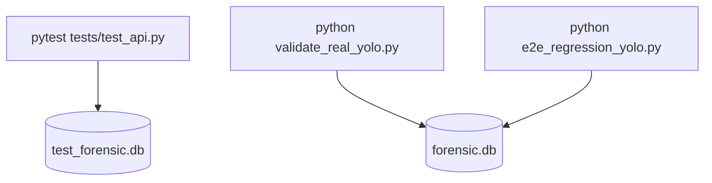

# Validation & Testing Manual

This document details the test suites, scripts, and validation procedures for the DVR/NVR Forensic Tool backend.

---

## 1. Test Architecture

The testing layout includes:
- **Unit & Integration Tests**: Contained in `tests/test_api.py` using `pytest` and `FastAPI.testclient`. Runs against an isolated database file: `test_forensic.db`.
- **Real YOLO Pipeline Validation**: Contained in `validate_real_yolo.py`. Directly audits real weights execution on the local db file `forensic.db`.
- **E2E Regression & System Audit**: Contained in `e2e_regression_yolo.py`. Runs client-simulate ingestion and real YOLOv8 extraction on the main database.



---

## 2. Test File Dictionary

### A. API Test Suite — `tests/test_api.py`

#### What it verifies:
1. **Case Registration**: Confirms `/api/v1/cases/` registers new cases, verifies duplicate number rejections, and validates Chain of Custody logging.
2. **Simulated Evidence Upload**: Uploads a dummy verification stream containing Hikvision file headers (`HKVS`). Asserts that the vendor is identified as Hikvision and that 3 cameras and video streams are registered in the database.
3. **Simulated AI Processing**: Mocks computer vision triggers using `/api/v1/analysis/{video_id}` with `mode="SIMULATED"`. Confirms that deterministic detections are saved with `SIMULATED` inference source values.
4. **Invalid API Requests**: Sends invalid video IDs and non-existent file paths to the API, asserting that the system handles them gracefully.
5. **YOLO Package Absence Handling**: Monkeypatches `ai_service.YOLO_AVAILABLE` to `False` and asserts that the API returns the correct `500 Server Error` exception messages on real-mode trigger calls.
6. **Real Inference Execution**: Generates a brief, 10-frame dummy video stream and triggers YOLOv8n object detection. Checks that the service processes the video without errors and returns the correct response schema.
7. **Playable Video Ingest Metadata Extraction**: Uploads a video containing 50 frames at 25 fps. Confirms that OpenCV successfully extracts its properties: `duration = 2.0s`, `resolution = 640x360`, and `fps = 25.0`.

---

### B. YOLO validation utility — `validate_real_yolo.py`

#### What it verifies:
Uses the local test asset [demo.mp4](file:///C:/Users/somes/.gemini/antigravity/scratch/forensic_dvr_tool/backend/test_media/demo.mp4) (5.073 seconds, 1280x720, 14.98 fps) to validate the real YOLOv8 object detection pipeline. It runs the model on the video frame-by-frame and verifies that both detections and chain of custody logs are successfully committed to the database.

---

### C. End-to-End Regression Audit — `e2e_regression_yolo.py`

#### What it verifies:
Simulates a complete client investigation session against the main database:
1. Registers a case and uploads `demo.mp4`.
2. Verifies that the video records contain the correct metadata (resolution: 1280x720, fps: 14.98, duration: 5.073s).
3. Targets the video record's UUID and triggers real object detection.
4. Audits the database to ensure detections are saved with the correct parameters (e.g. `REAL_MODEL` source and `YOLOv8n` model name).
5. Queries the chronologized timeline and chain of custody endpoints, asserting that all audit logs look correct.
6. Generates a markdown report, checking that it contains the investigation details and digital checksum signatures.

---

## 3. Running the Test Suites

To execute the tests, run the following commands in your terminal:

### Standard API Tests
```powershell
cd C:\Users\somes\.gemini\antigravity\scratch\forensic_dvr_tool\backend
pytest tests/test_api.py -v
```

### YOLO Pipeline Validation
```powershell
cd C:\Users\somes\.gemini\antigravity\scratch\forensic_dvr_tool\backend
python validate_real_yolo.py
```

### E2E Regression Audit
```powershell
cd C:\Users\somes\.gemini\antigravity\scratch\forensic_dvr_tool\backend
python e2e_regression_yolo.py
```

---

## 4. Current Test Status & Exclusions

### Pass/Fail Metrics
- **Standard API Tests**: **PASSING** (100% test completion).
- **YOLO Pipeline Validation**: **PASSING** (identifies object detections, validates metadata structures, and logs events).
- **E2E Regression Audit**: **PASSING** (verifies entire workflow in a single run).

### Untested Components
- **GPU Acceleration**: The system is tested exclusively on CPU environments. If GPU acceleration is used, manual check validations are necessary.
- **Physical Hard Drives / Raw Partition Images**: The current tests run on mock dumps containing signature headers. Testing actual physical image parses requires the forensic filesystem implementation.
- **Frontend Dashboard Screens**: Frontend UI components are not covered by these backend test suites.
